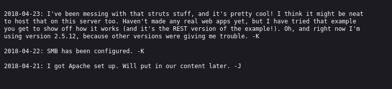
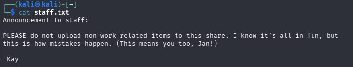

### Basic Pentesting CTF Writeup
https://tryhackme.com/room/basicpentestingjt

### Overview
All i was given for this CTF was the target machines IP address.

### Begin CTF

I used an nmap scan to find a open http server on port 80 with this command: nmap -Pn [target_ip]

Then i used gobsuster on that http server with this command: gobuster dir -u "http://[target_ip]" -w /usr/share/dirbuster/wordlists/directory-list-2.3-medium.txt -t 64

I then found a directory named development that had some files in them, one of the files contained information that a hash on the pc hosting the website was vulnerable to a hash enumeration rainbow table attack, which is useful for later but not right now as im not in the server yet. Then the other file said this:

There's some interesting information here, the first person mentions they are using struts the REST version on version 2.5.12, after doing a quick “struts 2.5.12” search on exploit db i found an exploit that i can use for remote code execution on the server hosting the website heres the CVE : 2017-9805. 

After some research i discovered that the other ports that were open (139 and 445) were hosting something called samba smbd 4 which is windows smb protocol that can be enumerated using a program called enum4linux, so i used this commmand: enum4linux -S [target_ip]

And found some shares named Anonymous and IPC$ the anonymous share normally has no password so i used this command to access it: smbclient //[target_ip]/Anonymous 

Then i used ls to list the files and there was one named staff.txt, so i downloaded it with "get staff.txt", exited with “exit”, and then read the file as it was downloaded to my computer now. Heres what it said: 

So now we know the person named J is Jan and K is Kay. which helps us answer the “what is the username question” it was Jan.

Since we know the ssh service is running from the port scan and that Jan has a weak password thanks to that one message we found on /development/j.txt i decided to try brute force her ssh login with hydra with this command:  "hydra -l jan -P /usr/share/wordlists/rockyou.txt ssh://[target_ip] -V"

This attempts all the passwords in rockyou.txt on the ssh login with the username jan.

We got the password “armando” and was able to answer the next question “What's the password?”

Then after sshing into jans computer i checked the home directory and found kay has a home folder. So after looking in it with the "ls -al" command i found a folder named ".ssh" that had read permissions for all users and inside it was a "id_rsa" file which contains kay's private key. 

After researching how i can exploit this flaw, i saved their private key, hashed it with this command "ssh2john id > hash.txt" to translate it to a hash format that john understands, then i used this command  "john hash.txt –wordlist=[path/to/rockyou.txt]" to get a password which was “beeswax”

Then i used this command to ssh into kay’s account: "ssh -i id kay@[target_ip]". This command uses the private key file (id) that i stole from kays files (because he faultily left the read permissions on for all users), and uses it to login to kays account, however it will still require a passphrase which i figured out after i hashed, and cracked the private key to get the passphrase “beeswax”. (keep in mind beeswax is the passphrase to the private key not the password to kay’s account)

Then after i got in i used "ls" to see the files in his home directory which contained a file named "pass.bak". And used the "cat" command to reveal it and it was his password: heresareallystrongpasswordthatfollowsthepasswordpolicy$$

That answers the final question of the CTF!
