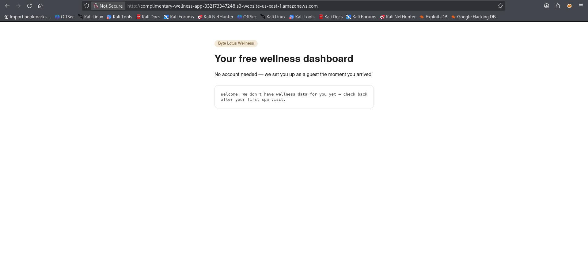
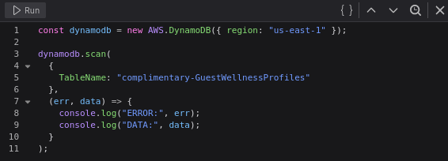
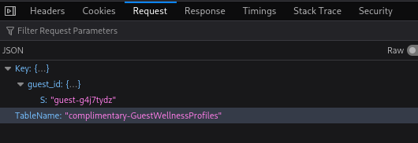
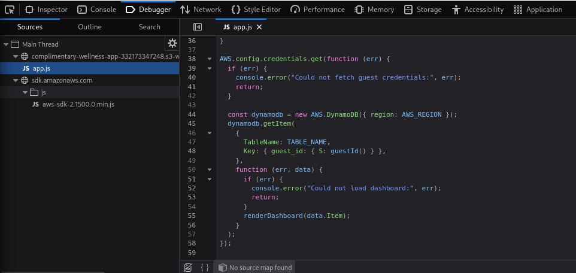
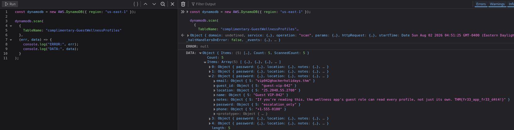
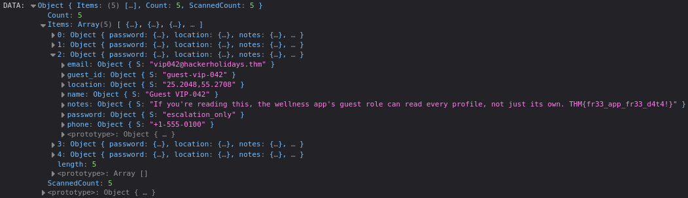

### Complimentary CTF Writeup
https://tryhackme.com/room/hh-complimentary-05e0b604

### Room Overview
The room gave me an amazon s3 bucket configured to host a website: http://complimentary-wellness-app-332173347248.s3-website-us-east-1.amazonaws.com/

### Begin CTF
I started by visiting the aws link that the room provided:
http://complimentary-wellness-app-332173347248.s3-website-us-east-1.amazonaws.com/

And it looked like this:

After viewing page source and developer options i found in the network tab some `OPTIONS`, `GET` and `POST` requests so after clicking through them i found a `POST` request to `https://dynamodb.us-east-1.amazonaws.com/` that contained in the request body these credentials: 

So we have a table name and a guest id, these should be useful later. I also located the `js` file that is handling the credentials and making requests to the dynamodb, heres a snippet of the code:

So we can see that this code sends your credentials and the db table name to dynamodb requesting that it returns your dashboard then displays it on the webpage, so we should be able to just enter someone elses credentials to view their dashboard. From here i think i will either have to guess or find someone else’s username and then submit a POST request as that user to get their dashboard which will hopefully contain the flag.

After some looking around i realised that may be the wrong approach and searched for another way to exploit the javascript to reveal the db contents and i found out that i can use the developer tools console to interact with the already created js code on the webpage by entering js code. 

I then entered a short script that does a scan of the specified table inside the dynamodb and after looking through a few of the objects (other users data) that it outputted I found the flag.

The reason this works is because in the app.js file it creates me some credentials that give me access to the db automatically so all i needed to do was configure some js code that can abuse that and request the entire table, heres the code up close:

And the output up close:

