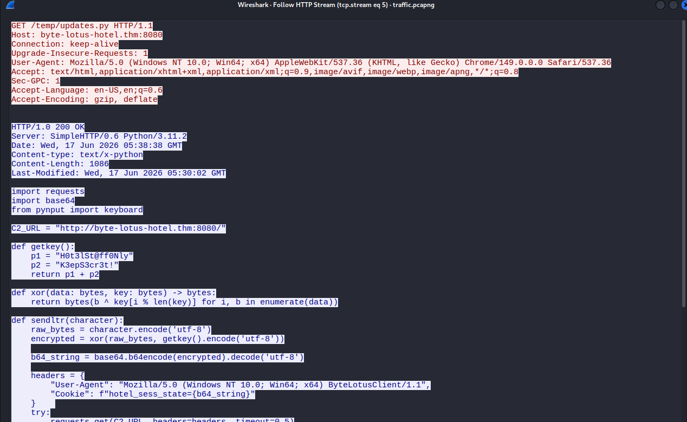
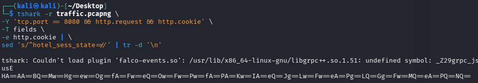
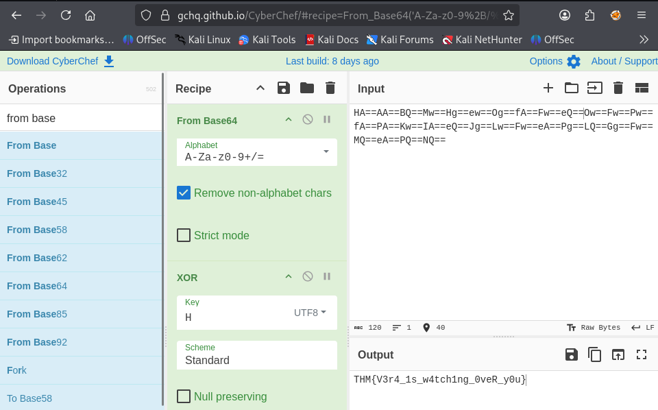

### Packed Light CTF Writeup
https://tryhackme.com/room/hh-packedlight-02e5330c


### Room Overview
The CTF provides a pcap file and gives some clues that theres a suspicious service running every so often and extracting encoded information.


### Begin CTF
After opening the pcap in wireshark i instantly found a `http` python server request and decided to follow the tcp stream:



Heres a GET request that is sent by `192.168.1.141:50419` and the response is from `34.41.103.191:8080`. Not sure if this will be useful but with my limited knowledge i found the response to be a little suspicious.


After using the statistics tab > conversations in wireshark. I found that these 2 addresses talk a lot and always in 10 to 16 packet conversations, could also be suspicious.

After rereading over the python file and asking chatgpt, turns out its malware. A keylogger running and sending one get request per keystroke it picks up. First it monitors the keystrokes, then when it receives one it encodes it with xor , which takes a key `(H0t3lSt@ff0NlyK3epS3cr3t!)` and the key pressed and follows the XOR rules to alter the bytes, then it encodes it with base64 (which all this does is turn the raw byte outputted from XOR into readable letter/s, even though it was originally 1 character base64 may output 4 characters), then it sends it in a http request hidden in a cookie `(hotel_sess_state)`.

So all i need to do is find all the http requests that have a `hotel_sess_state` cookie and then decode the base64 and XOR encoding of all the characters. To first get all the http requests with the cookies i constructed this console command:

```
tshark -r traffic.pcapng \
-Y 'tcp.port == 8080 && http.request && http.cookie' \
-T fields \
-e http.cookie | \
sed 's/^hotel_sess_state=//' | tr -d '\n'
```

This command opens the pcap file and filters the contents by the tcp port 8080 and by http requests and by http cookies. The `-T` flag specifies the output format, in this case it is fields which means only display the specific fields.  `-e` means to extract the http cookie instead of the entire packet. Its then piped into the `sed` command which removes `hotel_sess_state` from all the output so we just get the encoded characters. Then `tr` (transform) `-d` (Delete) `\n` (newlines) so that everything comes out in one line like this:



Now that i have all the encoded characters, i should just need to decode them for the final flag. 


I used the website cyberchef and i applied some decodings, first i decoded the base64, and secondly i needed to decode the XOR, however i had some troubles because i entered the entire key `(H0t3lSt@ff0NlyK3epS3cr3t!)` and i ended up getting broken characters as output, so eventually i discovered that since the keylogger was only sending one character at a time and XOR can only encode one character with one character from the key (because otherwise there would be an unequal amount of bytes) then all i need is the first letter of the key `(H)` as only that letter would have encoded every single keystroke and all the other letters in the key are irrelevant. 

So here is how it looked when i successfully decoded it:



And thats the flag!
