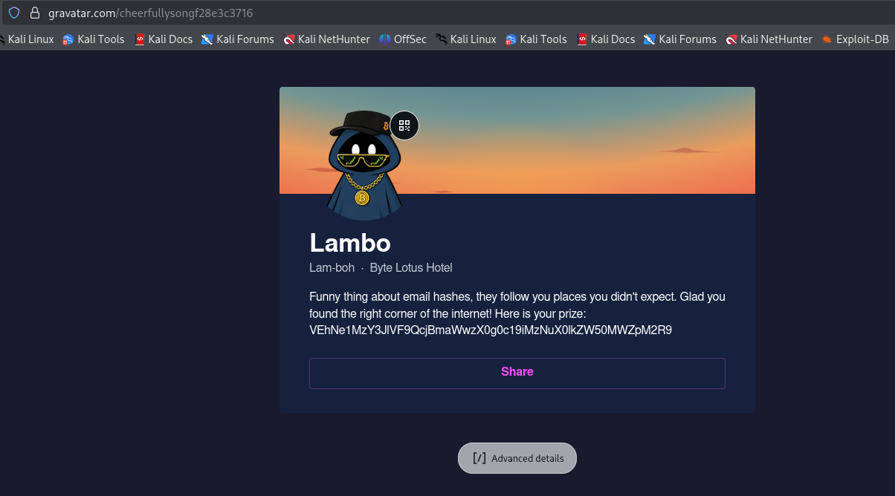
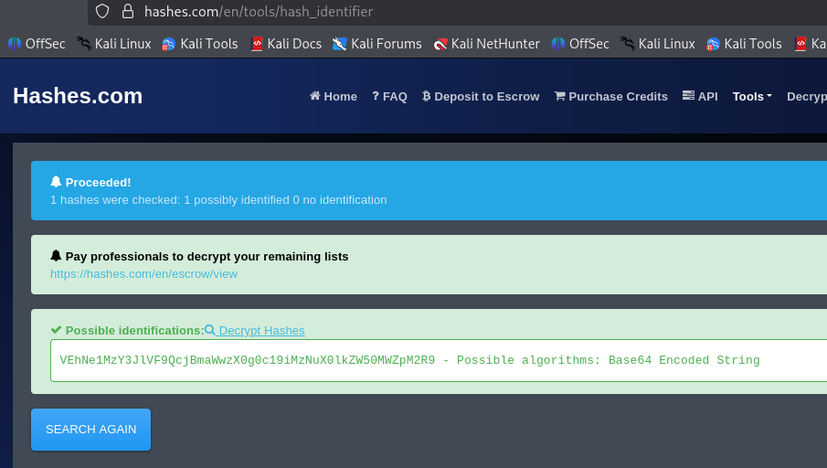
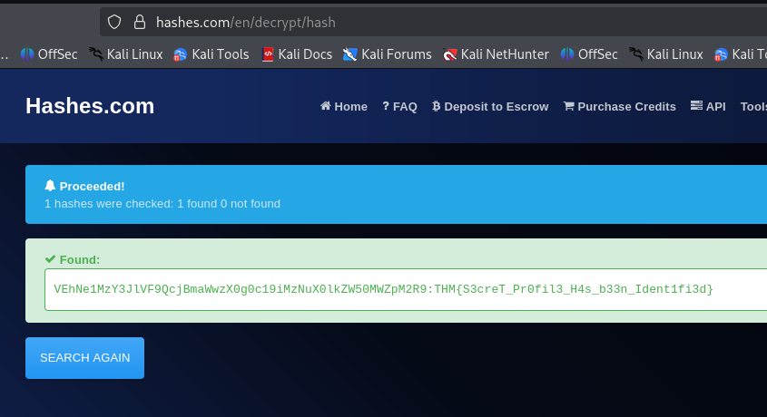

### Overheard at Breakfast CTF Writeup
https://tryhackme.com/room/hh-overheardatbreakfast-6f01793c

### Room Overview
The room provides a single screenshot of a discord conversation. This is an OSINT challenge.

### Begin CTF
Heres the image the CTF provided:

The two interesting parts about this conversation is firstly the profile that had lambos other accounts linked to it that starts with a G, and secondly that we got his email address: `lambobytelotushotel@gmail.com`

After some research i found out the accounts linking app is definitely `Gravatar`, and i also found out that its possible to get someones gravatar account just from hashing their email (in lowercase) and then finding it at this endpoint `gravatar.com/avatar/[hash]` or `gravatar.com/[hash]`

So i used this command to hash his email: `echo -n 'lambobytelotushotel@gmail.com' | md5sum`

How this command works:
- `echo -n` - `echo` outputs the following string in the quotations to the terminal and `-n` removes the newline that is typically added
- `|` - the pipe symbol is used to send the output of echo to the following command which is `md5sum` instead of outputting it to the terminal
- `md5sum` - this command hashes the received string in md5 format and outputs the result in the terminal.

The reason we cant just do something like `md5 "[email]"` is because md5 expects a file and it will interpret the quotations as the literal file name, so we get around it by using the pipe command and echo which pipes the `stdout` from echo to the `stdin` of md5.

Heres the resulting hash:

After i got the resulting hash i entered this url into the url bar: `https://gravatar.com/d4a5fc5d3128890778667e24617d7cc0`

And it redirected me to this page:

From this i received a long text string that seems to be another hash: `VEhNe1MzY3JlVF9QcjBmaWwzX0g0c19iMzNuX0lkZW50MWZpM2R9`

So i put it into hashes.com’s hash type identifier and it says its base64 encoded string:

Finally i put it into hashes.com’s decrypt function and it revealed the flag: 

That completes the CTF.

What i learned:
I learnt that an app named `Gravatar` that people can sign up to and post their social medias or make a bio and it acts as a central hub for their social medias, and their profile is viewable if we have their email. All we have to do is hash the email in `md5` format, then put the resulting hash in this url path `gravatar.com/[hash]`. This is a very useful thing to know as it is a helpful OSINT tool. 

