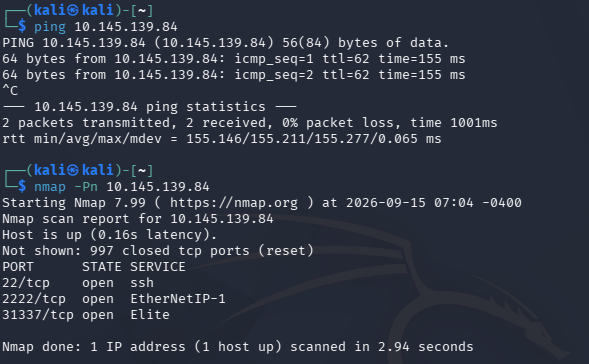
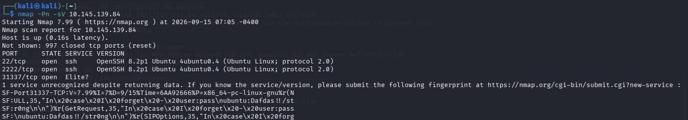
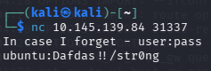

# [Intermediate Nmap] Writeup

**TryHackMe:** [https://tryhackme.com/room/intermediatenmap]

## Overview

**Category** -- [Reconaissance]

**Difficulty** -- [Easy]

**Provided Info** -- [A single lab machine IP and some hints towards using netcat]

**Questions:**

- `Find the flag!`

---

## 1. Nmap Recon

First i started with a ping to the target to test if it was online and it was, so i continued to a default nmap scan using this command: 
```
nmap -Pn [target_ip]
```



I found 3 ports open:
- 22 - ssh
- 2222 - EtherNetIP-1
- 31337 - Elite

I then attempted a service version scan with this command:
```
nmap -Pn -sV [target_ip]
```
- `-Pn` - skips host discovery and only does a port scan
- `-sV` - runs extra probes / checks to find more information on services running
Heres the results:



## 2. Netcat Connection

Since this didn't really give me any information i attempted to use netcat to connect to this port with this command:
```
nc [target_ip] 31337
```
and here's the output i got:



(The user and password was also in the service version Nmap scan but i just missed it)

## 3. SSH Login

Since i knew ssh was running i used this command to connect to ssh with the user ubuntu:
```
ssh ubuntu@[target_ip]
```
then entered the password and found the flag in the `user` home directory.

## Conclusion
This was a quick and simple nmap CTF challenge that used the following tools:
- `Nmap`
- `Netcat`
- `SSH`

## What i learned
Although this was a short room, missing the fact that the user and password was outputted in poorly formatted text during my service version (`-sV`) Nmap scan made me understand that i need to spend a little extra time making sure i don't miss things, and that sometimes reading through boring strings of text can be crucial in a real penetration test.