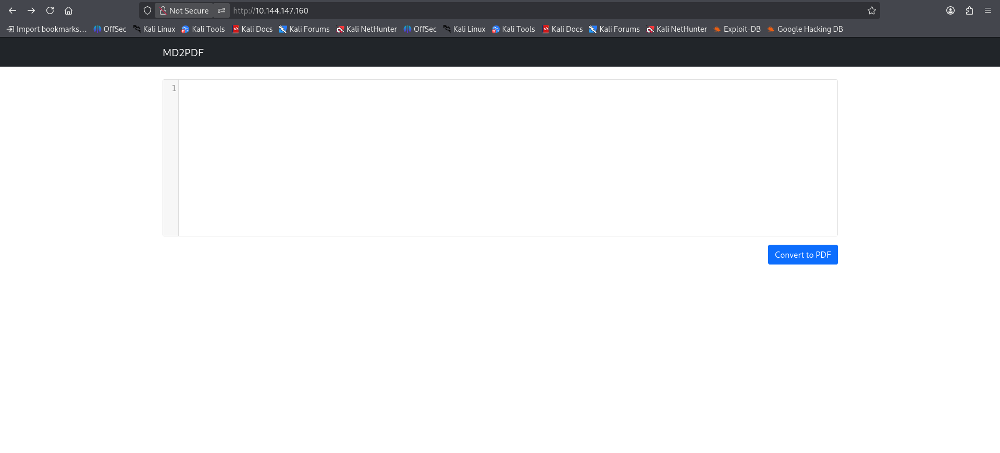
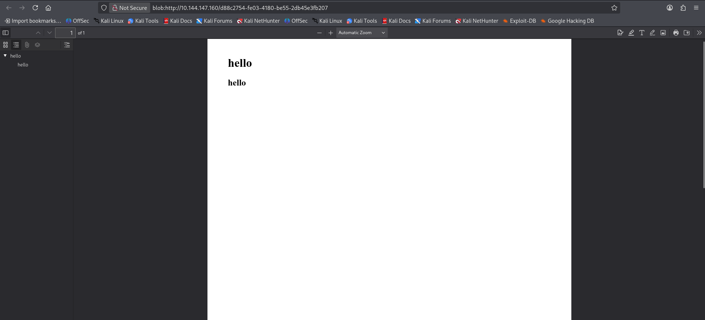
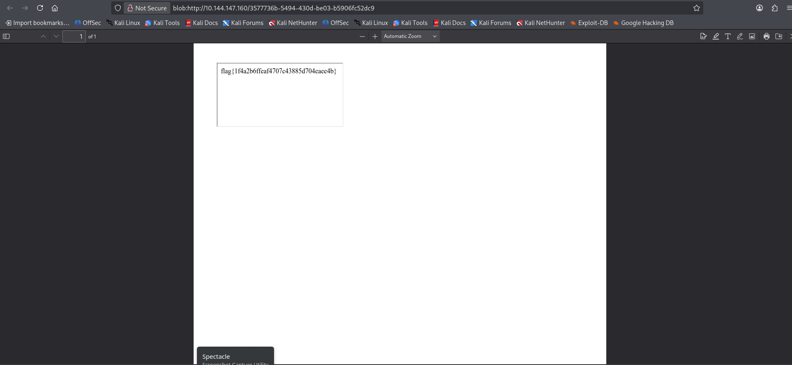

### Basic Pentesting CTF
https://tryhackme.com/room/md2pdf

### Overview
All i was given for this CTF was the target machines IP address.

### Begin CTF
I started by doing an nmap scan on the targets ip and found they have http open so i search their ip in the urlbar and found this site running:



Since i have a text input box that converts what i type into a different format i suspected i would need to use xss (cross-site scripting). Then i tested for java xss with a typical alert command and it didnt work, so then i tested for html xss and it worked since you can see the headers are different sizes in the document which means the code i put in was read and executed by the website. Heres the html i used: ```html
<h1>hello</h1>
<h2>hello</h2>
```



Now that we know html works we can save that for later as we look for other things so using gobuster with this command:  gobuster dir -u "[target_ip]" -w /usr/share/wordlists/dirbuster/directory-list-2.3-medium.txt 

I discovered a hidden directory named /admin and on that page it said the admin page is forbidden and only available from localhost:5000

This is great news because using html code injection we can actually request that web page with code, and the website will request it for us meaning the request is still coming from localhost but then being forwarded to us. So heres the html code i used in the md2pdf converter: <iframe src="http://localhost:5000/admin"></iframe>

By doing this i just abused cross-site scripting to allow me to achieve server-side request forgery.

Then the pdf just outputted the flag that was on the admin web page: 



That answers the final question to the CTF!
