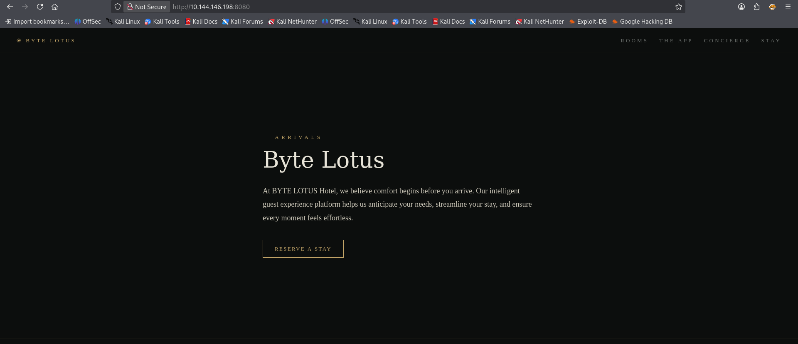
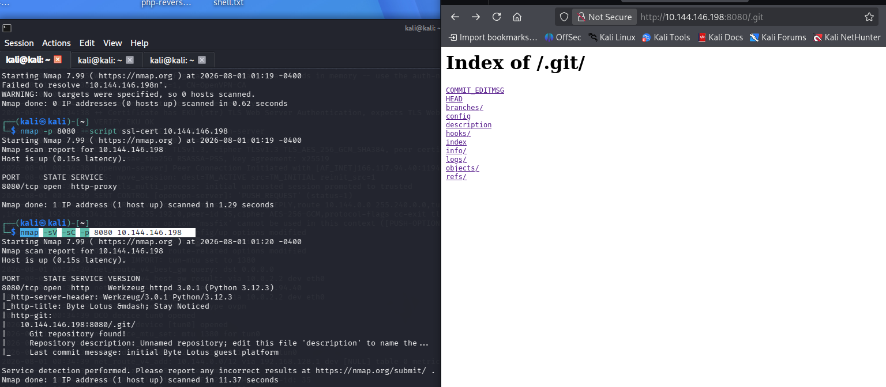
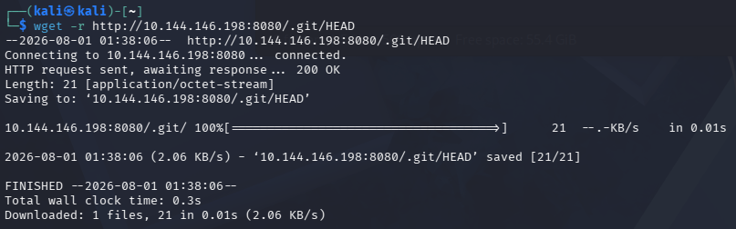
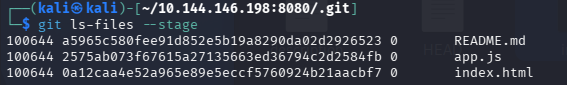
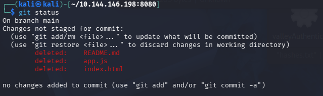
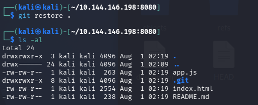

### Room 404 Write-up
https://tryhackme.com/room/hh-room404-804573bf

### Room Overview
The introduction to the CTF gave a local site which is `http://[target_ip]:8080/`

### Begin CTF
I visited that site and heres what it looked like:

The only button on the page that leads anywhere or does anything is the reserve a stay button which takes me to `http://[target_ip]:8080/booking`
However i only get 404 not found on that page.

All the source code on both webpages looks fine, nothing suspicious or that i can exploit.

I then tried to user this command with gobuster:
`gobuster dir -u "http://[target_ip]:8080/" -w /usr/share/wordlists/dirbuster/directory-list-2.3-medium.txt -t 60`

And its taking a while so i left it running in the background.

Then i tried some nmap scans and after running this scan i found some information that could be useful:
`nmap -sV -sC -p 8080 [target_ip]`

I then clicked on the links and they all lead to error 404 pages so i had to use a different method. I used the wget command in terminal to download all the files located in .git like this:

(i had to do them all individually)

After i downloaded them i had a look through almost every single file, attempted to crack some hashes and failed finding anything important with those methods however after some research i found that i can use actual git commands on this .git file instead of just normal folder exploring commands like `ls` and `cd`, so i went to the git folder and used: 
`git ls-files --stage` (this command lists the files currently tracked by git in the index file and the staging information)

I then found out that there was 3 files that i didnt have access to (this command doesnt list files in the current directory, it lists files that have actually been indexed in the index file)

Then i used `cd ..` to get to the parent folder of the .git folder and used this command to check if the files i saw in index are missing from my git session: git status

As you can see 3 files are reported as deleted, (really all it means is they aren't synced with the official .git repo because i never downloaded them i only downloaded what was inside .git and the actual build files are outside of .git in the parent folder)

So i used: git restore . to restore all the files, and then as you can see it worked.

Then i used cat README.md and found the flag!

