### Overview
This TryHackMe CTF only provided a single target IP address and nothing more.

### Starting the CTF
I started by using a nmap scan on the targets ip and found a http server running, after visiting it i used gobuster on it and found some other directories, i then used gobuster again on the directory /static and found another directory /static/00 which had some important information on it: 

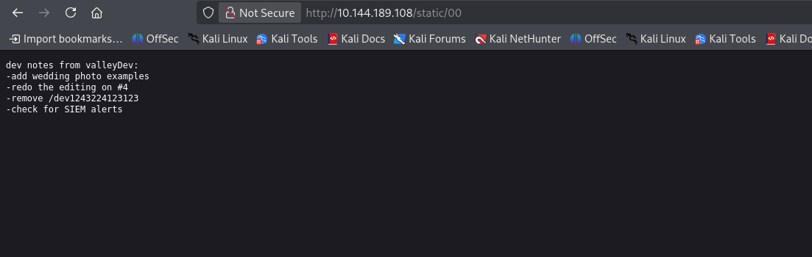

Then after vising /dev1243224123123 i found a login page: 

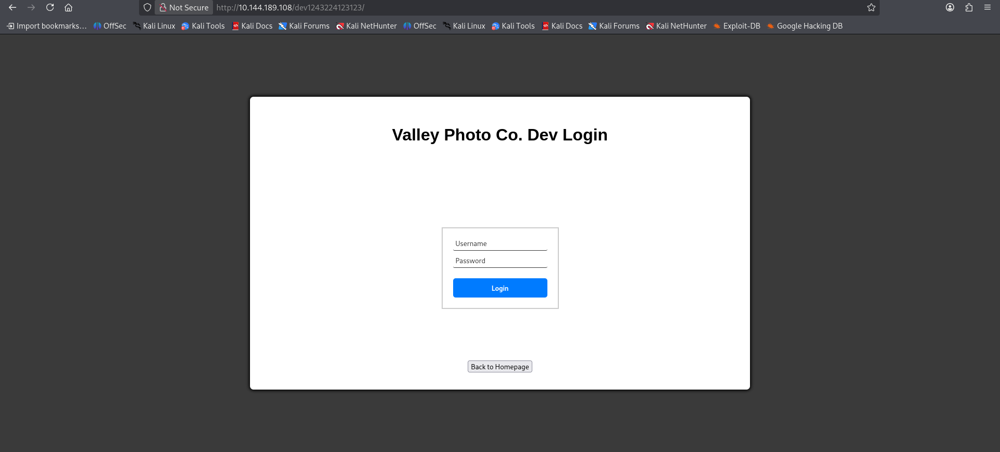

After entering a few logins and monitoring the network tab in devtools, i got suspicious that nothing was appearing meaning the logins are all handled locally within the website instead of being confirmed within a server, so i checked debugger - sources in dev tools and looked through the js for dev.js and found this: 

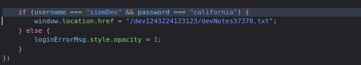

So i just copied the devNotes directory and put it in the url bar (it was faster than logging in)

And heres what i found on that directory:

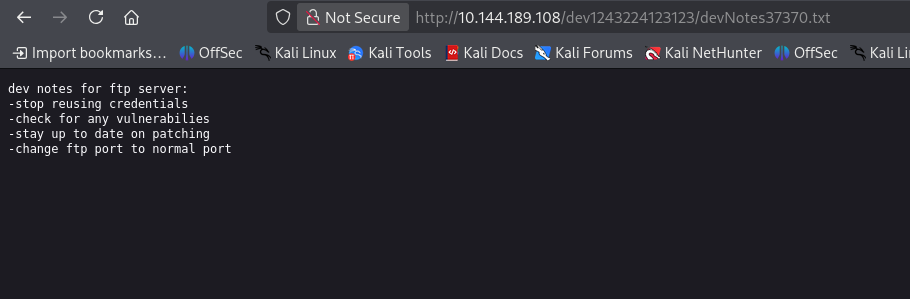

So now i know that some of their credentials are the same so siemDev may be the username and california may be the password for multiple accounts, and that their ftp port is not on the normal port (which is 21)

So to locate the uncommon port i did a bigger scan of the all ports with this nmap command: nmap -sV -p- -v 10.144.189.108

I ended up finding it on port: 37370/tcp open  ftp     vsftpd 3.0.3

I could then use the command: ftp 10.144.189.108 37370 
And when it asked me for a username i put in siemDev and the password was california as i suspected.

I then found some pcap files and downloaded them with the get command and then put them into wireshark, i searched for http and in the siemHTTP2.pcapng file i found a post form with this in them: 

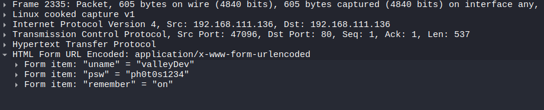

For some reason i put this into ssh and it worked (idk why this would work on ssh)

Then in their home directory i read a file named user.txt and found the first flag of 2 flags:
THM{k@l1_1n_th3_v@lley}

After going back a directory i find a suspicious file named valleyAutheticator that sticks out. When i cat it its encoded, when i strings it i dont have auth and when i nano it i dont have auth, so i start a http server within that directory by using this command python3 -m http.server then i go to my kali session and download it with wget [machine_ip]:8000/valleyAuthenticator 

Now i have it on my device and i can use strings since its my file that i have auth over now so i used this command: strings valleyAuthenticator > valley.txt

At the top and the bottom of the valley.txt file theres lines that say UPX! UPX! 

After looking it up i found out that UPX stands for ultimate packer for executables, which means this file i have was packed and compressed by this program and therefore all the strings are jumbled nonsense, so i used the command: upx -d valleyAuthenticator to decompress the executable and then once again used strings valleyAuthenticator > valley2.txt to get the strings

Then after using this cat command paired with a grep command i located some interesting looking hashes above the username and password inputs:

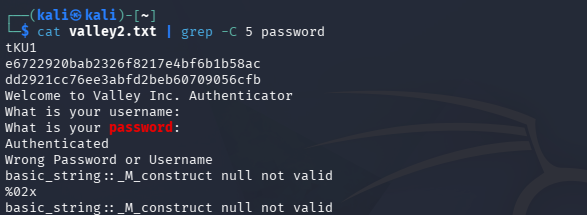

I then saved these to a file and used a hash type identifier website to find the type of hash they are:

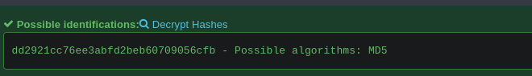

Then i used this command with john to crack them:

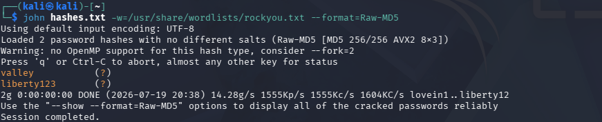

And as you can see i got both the username and password valley and liberty123

Now i can ssh into that account and explore what my privilege escalation options are.

I used the command cat /etc/crontab and found this:

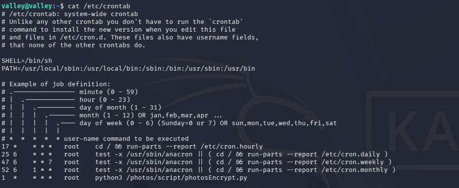

The bottom command is a python script being auto run every minute by the root user, this is a highly likely suspect on a CTF, this means if i can somehow inject a reverse shell in this python script i will have access as the root user of the computer.

Unfortunately I cant write to this script. But after cat-ing the python script being run i found out that it imports a library called base64 which after using this command i found out i can write to it:

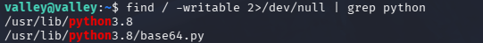
 
The next part was simple, all I did was import os and put a reverse shell in the library while a listener was running on my attacking machine and I got access to the root user:

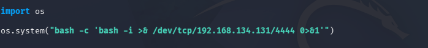

I then used ls to view the root users home folder and found the final flag!
